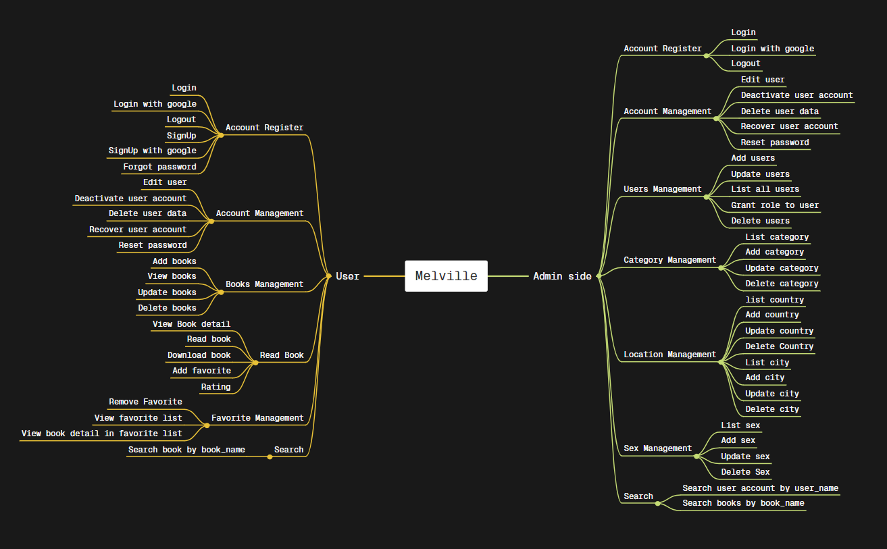
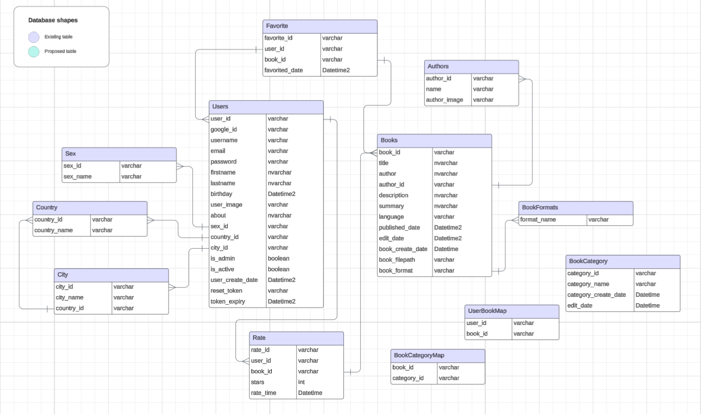
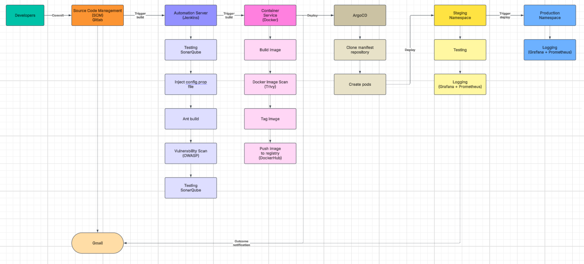

# Melville Design
We'll cover the following
+ [System Requirements](#system-requirements)
+ [Use Case Diagram](#use-case-diagram)
+ [Features Graph](#features-graph)
+ [Activity Diagrams](#activity-diagrams)
+ [Database](#database)
+ [CI/CD](#cicd)
+ [Code](#source-code)

Melville is an online reading website, which allow everyone to read all books from the internet. All operations of this website are controlled by **admin**. To be able to upload books **users** will have to make a request to admin to grant permission. When permission granted, user will become, **author** then they can upload their books. If user haven't register an account yet they will called **guest** and can view book only.

## System Requirements

We will focus on the following set of requirements while designing Melville:

#### Main Function

##### For user:
1. Users should be able to Login or signUp, also login and signup with google account.

2. Users should be able to reset the password if they forgot.

3. Users should be able to edit their profile account.

4. Users should be able to deactivate their own account or delete user account and all data related to that account.

5. Users should be able to reactivate their account.

6. Users should be able to search books.

7. Users should be able to read, download, add favorite, rating, share link, like a book.

8. Users should be able to remove favorite.

##### For author:

6. Only system admin can have full control over users and books includes (view, create, update, delete users, books, category, authors, etc...).

7. All uploaded images and book files will be stored in MinIO Server as a block storage

8. All user password have to encrypted using Bcrypt.

9. The website should be able to send notifications to users whenever a reservation is made/modified or there is an update.

#### Server side 

1. A separate MSSQL Server using docker
2. A MinIO server to store our resources (user_image, author_image, book_file , etc....)
3. Use Gitlab as version control, our git repository will have 2 branch (1 for development, 1 for main)
4. Use Jenkins for CI (Continuous Intergration)
5. Use Dockerhub for docker registry
6. A git repository to store Kubernetes Manifest file
7. Use ArgoCD for CD (Continuous Deployment)
8. Deployment environment will be a kubernetes cluster with 2 nodes and 2 namespaces (1 for testing, 1 for production)

## Use Case Diagram

We have 3 main Actors in our system:

+ **Admin:** Responsible for full control over users, books, categories
+ **Users:** Will be able to uploads books, view uploaded books, modified books, remove books, add favorite book, download book.
+ Guest: Can only view book and download books, but cannot add favorite, uploads books, view uploaded books, modified books, remove books,

Here are the top use cass of Melville website:

+ Search books: To search for books that user want to read
+ Create/Modify/View books: To upload a book, remove it, or view details about book.
+ Read books: Allow user to read books.
+ Add favorite: To save book and read it later.
+ Download book: To download the book that user want to read it on their device.

## Features Graph

## Database

Our system will have total 12 table:
+ Users
+ Sex
+ Country
+ City
+ Books
+ BookCategory
+ BookCategoryMap
+ BookFormats
+ Authors
+ Favorite
+ UserBookMap
+ Rate

In this database design there are 2 key concept to notice: 
1. Users table:
	+ User can upload as many books as they like 
	+ User can add many favorite books to their bookshelf as they like
	+ User can rate many books as they like
2. Books table:
	+ 1 book can have many category
	+ 1 book can only have 1 author

## CI/CD

We will use CI/CD to automatic build test and deploy to server. Jenkins will automatic detect changed branch, then it will start run build steps, after run complete jenkins will start dockerize the webapp and push to DockerHub. After pushed to Dockerhub with a version tag, update the manifest file to match docker image version with the image in Dockerhub, then ArgoCD auto detect file changed an deploy to kubernetes.

Here's the flow chart for Jenkins build steps:

## Source Code

All source code will store in GitLab, you can access with [this link](https://gitlab.fleeforezz.site/jso/melville.git)
